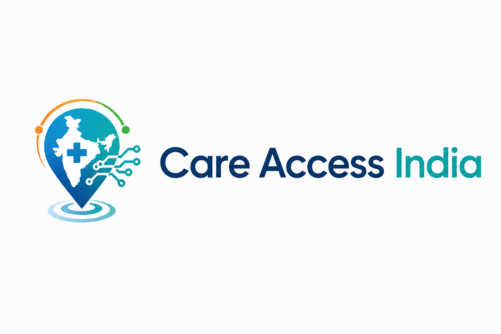

# CareAccess India

<p align="center">
  
</p>

<!-- Add the project logo at docs/assets/careaccess-logo.png. A wide PNG works best here. -->

CareAccess India is a Databricks hackathon workspace for identifying district-level care access priorities in India. The project combines Lakeflow Spark Declarative Pipelines, Databricks SQL AI functions, Lakebase synced tables, and a Databricks AppKit UI.

Use `careindia-access-v2` for the application. The `careindia-access-v1` directory is an older UI iteration and should be treated as reference material only.

## What Is Here

| Path | Purpose |
| --- | --- |
| `careindia-access-v2/` | Canonical CareAccess India UI. Node.js, Express, React, Vite, Tailwind, AppKit, and Lakebase. |
| `careindia-access-v1/` | Previous UI iteration. Do not start new work here unless you are intentionally comparing history. |
| `Hackathon-ETL/` | Databricks Lakeflow Spark Declarative Pipeline transformations for bronze, silver, and gold tables. |
| `Hackathon-Views/` | Exported Databricks notebook/view work used to create and maintain downstream views and Lakebase sync inputs. |

## System Flow

1. `Hackathon-ETL/transformations/bronze/nfhs_raw.py` reads NFHS-5 district health indicators from Unity Catalog.
2. `Hackathon-ETL/transformations/silver/nfhs_cleaned.py` cleans survey percentages and selects the columns needed for care-desert analysis.
3. `Hackathon-ETL/transformations/gold/care_desert_indicators.py` creates the district population-risk materialized view.
4. `Hackathon-ETL/transformations/gold/facility_capability.sql` creates a facility capability materialized view using `ai_query()` with a strict JSON schema.
5. `Hackathon-ETL/transformations/gold/facility_district_distances.py` calculates district centers and facility distance coverage.
6. `Hackathon-Views/` contains Databricks-exported view work that supports deduplication, view generation, and Lakebase sync tables.
7. `careindia-access-v2/` reads the synced Lakebase tables and renders the planning console.

The UI reads Lakebase only. Data mutation and derived-table creation belong in Databricks ETL or view work, not in the app server.

## Main Data Products

The v2 app expects Lakebase synced tables in the `default` schema, including:

- `care_desert_indicators_sync`
- `facility_district_distances_v_sync`
- `facility_district_distances_s_v_sync`
- `healthcare_master_view_v_sync`
- `facility_capability_v_sync`

The app combines population risk, facility capability, district center coordinates, facility distances, and intervention priority into the CareAccess India map and planning-priority views.

## Run The UI

Prerequisites:

- Node.js 22+
- npm
- Databricks CLI authenticated to the `careindia-access` profile
- Access to the Lakebase project configured in `careindia-access-v2/databricks.yml`

```zsh
cd careindia-access-v2
npm install

db_token=$(databricks postgres generate-database-credential \
  projects/careindia-access-local/branches/production/endpoints/primary \
  --profile careindia-access -o json | jq -r '.token')

DATABRICKS_CONFIG_PROFILE=careindia-access \
PGUSER=your_databricks_user \
PGPASSWORD="$db_token" \
npm run dev
```

Open `http://localhost:8000`.

For persistent local configuration, copy `careindia-access-v2/.env.example` to `careindia-access-v2/.env` and fill in local-only values. Keep `.env` out of git.

## Validate The UI

Run these from `careindia-access-v2/`:

```zsh
npm run typecheck
npm run lint
npm run build
npm run test:smoke
databricks apps validate --profile careindia-access
```

The smoke test starts the local app with Playwright and writes screenshots and logs to ignored test artifact folders.

## Deploy The UI

The v2 app is declared as a Databricks App through Databricks Asset Bundles:

- `careindia-access-v2/databricks.yml` declares the `careindia-access-v2` app and Lakebase Postgres resource.
- `careindia-access-v2/app.yaml` starts the built Node server with `npm run start` and receives `LAKEBASE_ENDPOINT` from the Databricks App resource.

Typical commands from `careindia-access-v2/`:

```zsh
npm run build
databricks bundle validate --profile careindia-access
databricks bundle deploy --profile careindia-access
```

## Work On The ETL

The ETL files are Databricks Lakeflow Spark Declarative Pipeline assets. Python transformations use `from pyspark import pipelines as dp`; SQL pipeline files should use Lakeflow syntax such as `CREATE OR REFRESH MATERIALIZED VIEW`.

The `facility_capability.sql` transformation uses Databricks SQL `ai_query()` to classify facility capabilities from documented fields. Keep that output schema strict and grounded in source fields so downstream views and the UI continue to receive stable columns.

See `Hackathon-ETL/README_Care_Indicators.md` for the population-risk calculations and column definitions.

## Repo Notes

- `careindia-access-v2` is the supported UI path.
- `Hackathon-ETL` and `Hackathon-Views` are Databricks data pipeline assets, not frontend code.
- The app server should remain read-only against Lakebase.
- Local Databricks state, environment files, build outputs, Playwright reports, Python caches, and generated AppKit endpoint types are ignored by git.